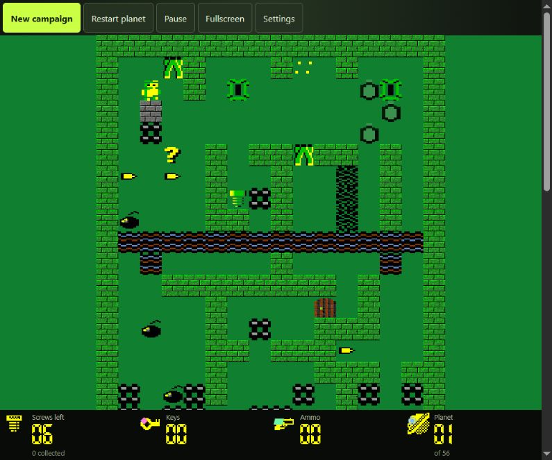
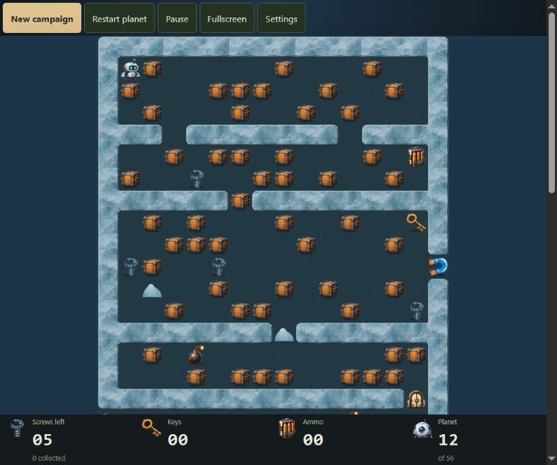
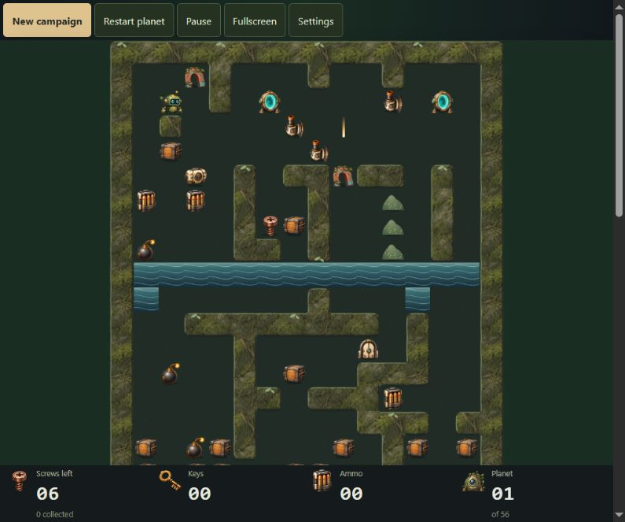
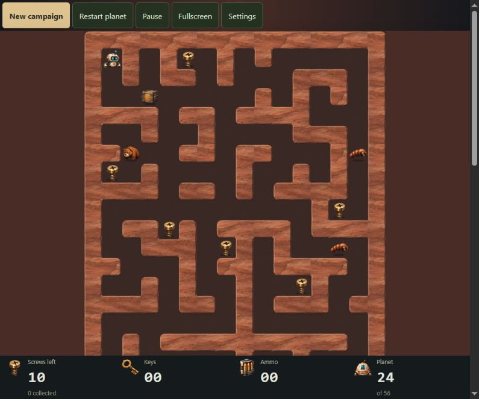
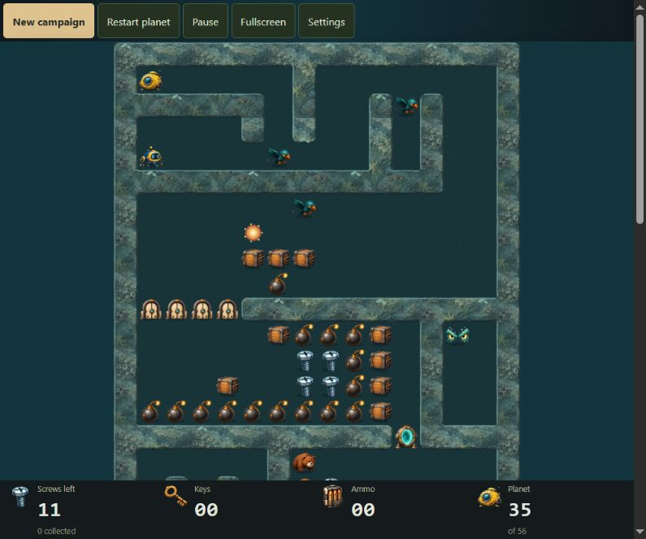

# Robbo

  

  A browser restoration of <strong>Robbo</strong> — two historical campaigns,
  56 planets each, and a choice of artwork while you play.

  <a href="docs/development.md#play-locally">Play locally</a>
  &nbsp;·&nbsp;
  <a href="docs/README.md">Documentation</a>

## The mission

Collect every screw, avoid hazards, unlock routes and reach the ship. Robbo
supports keyboard, gamepad and touch controls, as well as deterministic
replays for sharing or investigating a run.

  <strong>↑ ← ↓ →</strong> move &nbsp;·&nbsp; <strong>Ctrl + arrow</strong> fire &nbsp;·&nbsp; <strong>R</strong> retry &nbsp;·&nbsp; <strong>P</strong> pause

## Four worlds, four moods

  
  

  <em>Ice Moon · planet 12</em> &nbsp;·&nbsp; <em>Jungle Planet · planet 1</em>

  
  

  <em>Red Desert · planet 24</em> &nbsp;·&nbsp; <em>Ocean World · planet 35</em>

## Documentation

Technical material lives in the [documentation index](docs/README.md):
[local play, builds and validation](docs/development.md),
[architecture](docs/architecture.md),
[campaign import](docs/campaign-import.md), and
[contributing](CONTRIBUTING.md).
