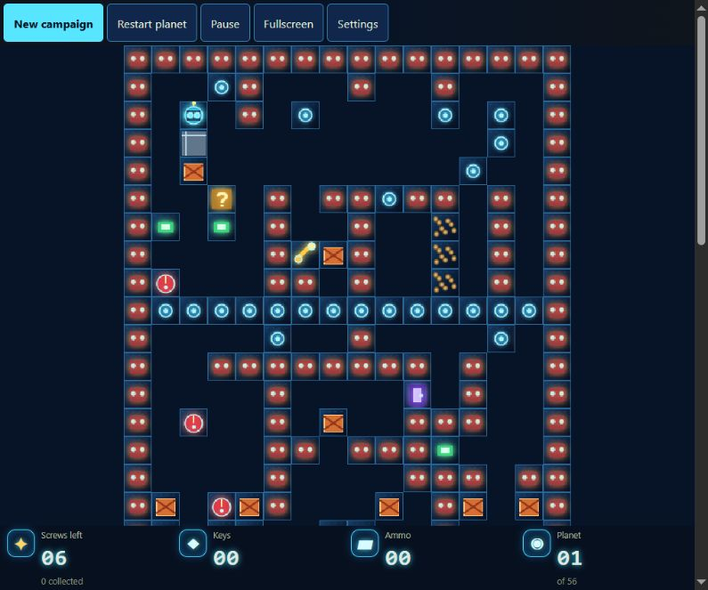

# Robbo

<p align="center">
  
</p>

<p align="center">
  A browser restoration of <strong>Robbo</strong>: two historical campaigns,
  56 planets each, and artwork that can be switched while you play.
</p>

<p align="center">
  <strong>↑ ← ↓ →</strong> move &nbsp;·&nbsp; <strong>Ctrl + arrow</strong> fire &nbsp;·&nbsp; <strong>R</strong> retry &nbsp;·&nbsp; <strong>P</strong> pause
</p>

## See the game

<p align="center">
  
  
</p>

<p align="center">
  <em>Java reference</em> &nbsp;·&nbsp; <em>Neon Forge</em>
</p>

Collect every screw, avoid hazards, unlock routes and reach the ship. The game
supports keyboard, gamepad and touch controls, deterministic replays, and a
choice of preserved and modern artwork themes.

## Run locally

Use Node **>=24.21.0 <25** (see `package.json` and `.nvmrc`). From the repository root:

```sh
npm ci
npm start
```

Open http://127.0.0.1:8080. To build the portable game:

```sh
npm run package
```

Open `release/robbo/index.html` directly, or run `npm run preview` and open
http://127.0.0.1:8080. Stop the development server before starting the preview;
both use port 8080. `dist` and `release` are generated, ignored directories.
Packaging deliberately produces a self-contained IIFE so the game works through
`file://`, as well as on GitHub Pages.

## Validate

```sh
npm test
npm run test:tooling
npm run package
npx playwright install chromium firefox
npm run test:dev
npm run test:browser
npm run test:input
npm run test:session-browser
npm run test:viewport
npm run test:artwork
npm run test:performance
```

The release browser commands package the game first; `test:dev` starts Vite
on port 8082 and checks the development entrypoint. To test an already built release,
run the corresponding `tests/browser/*.check.cjs` with Node. Run those checks
sequentially: some start a server on port 8080. Set `ROBBO_BROWSER=firefox` for
the additional viewport check; `ROBBO_CHROMIUM` optionally selects a Chromium executable.

## Repository map

| Directory | Responsibility |
| --- | --- |
| `src/engine` | Game rules and world state |
| `src/application` | Sessions and deterministic replay |
| `src/browser` | Input, audio and persistence |
| `src/presentation` | Canvas, themes and messages |
| `src/app` | Browser startup and controllers |
| `src/generated` | Imported campaign data; never edit manually |
| `website` | Shipped HTML, CSS and assets |
| `resources` | Canonical maps and source artwork |
| `archive` | Unused assets retained outside the release |
| `tests` | Unit, integration, browser and tooling checks |
| `scripts` | Data import, release and development tools |

See [architecture](docs/architecture.md), [campaign import](docs/campaign-import.md),
[contributing](CONTRIBUTING.md) and the [documentation index](docs/README.md).
